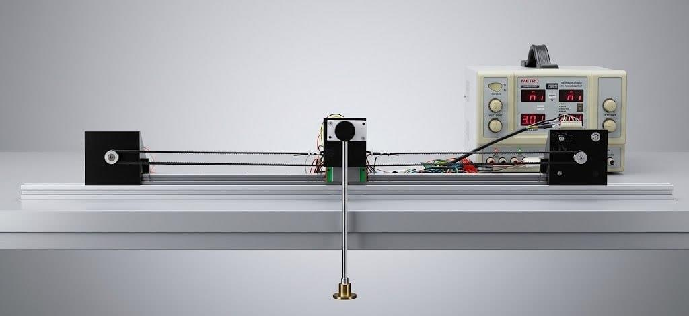
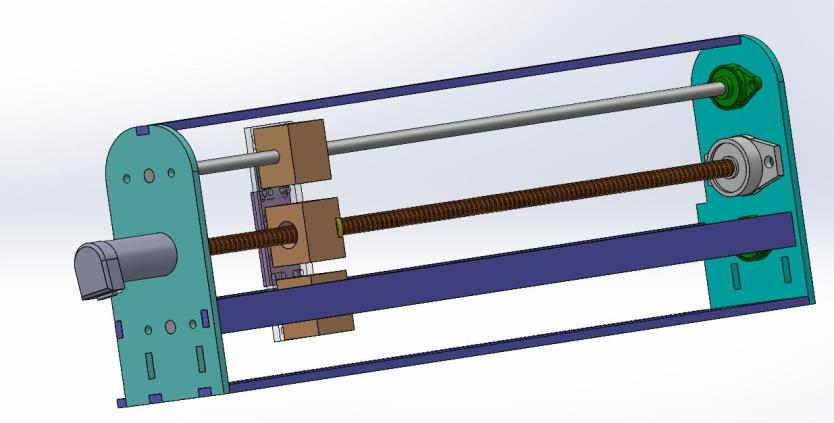
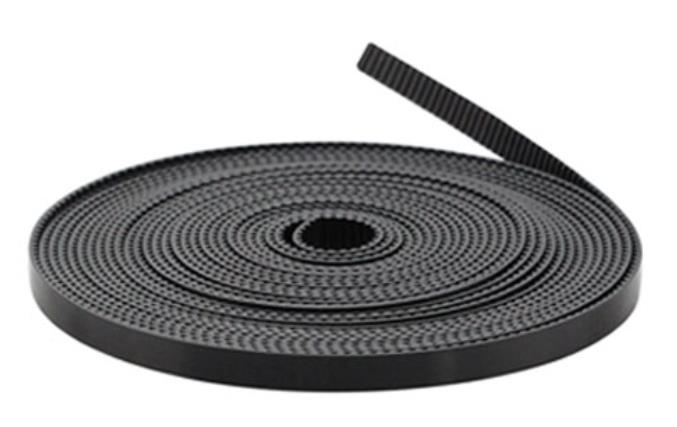
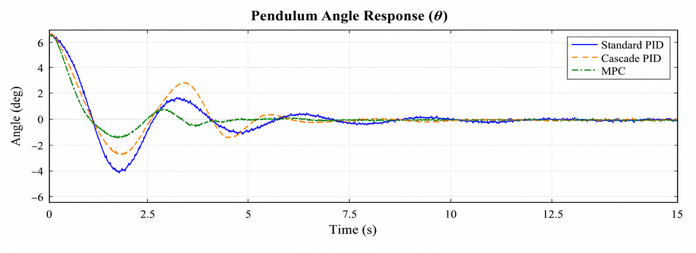
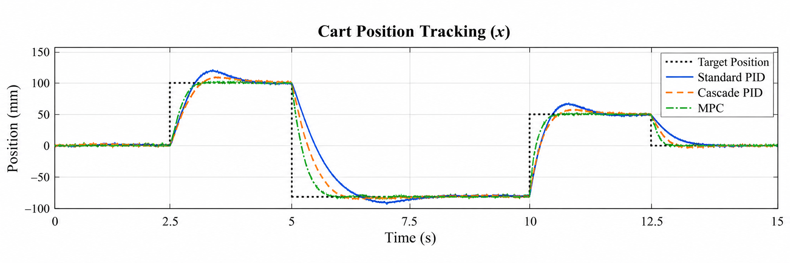
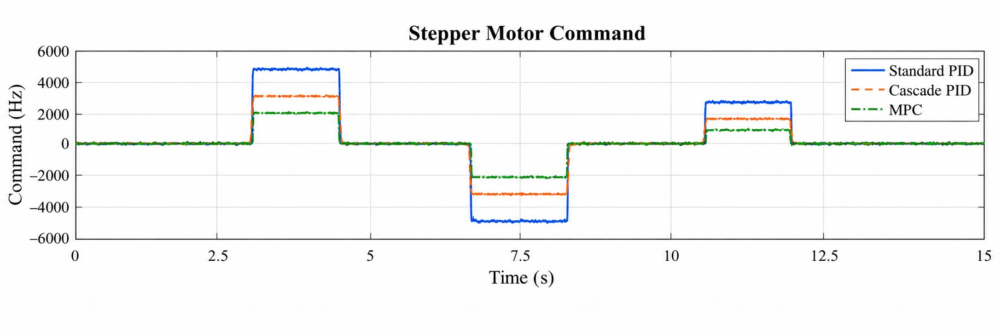
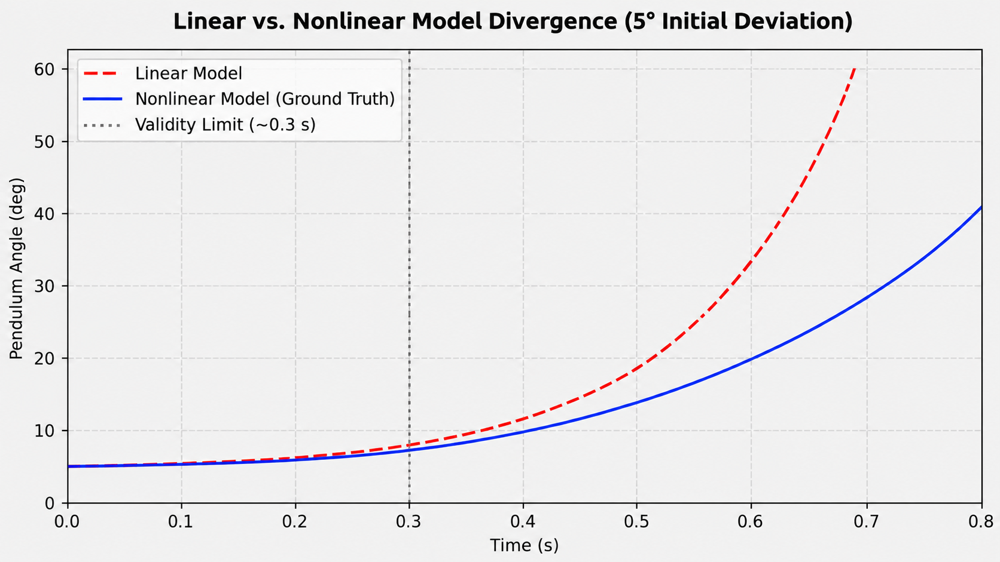
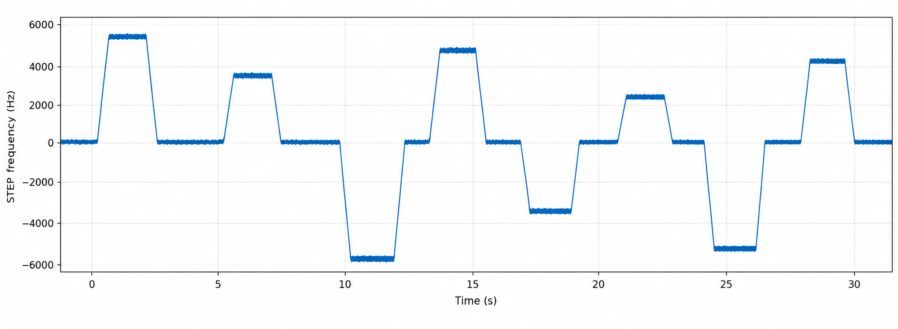
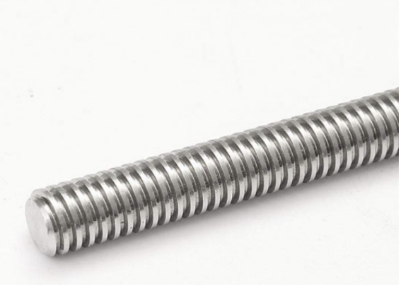

# PID and MPC Control of a Cart–Inverted Pendulum

Design, implementation, and comparison of PID and Model Predictive Control (MPC) algorithms for stabilizing an inverted pendulum mounted on a cart.

## Plant and controller comparison

### Main plant views

<p align="center">
  
</p>

<p align="center">
  
  
</p>

### Three-controller comparison

The plots below compare Standard PID, Cascade PID, and MPC on the same cart–inverted pendulum study.

<p align="center">
  
</p>

<p align="center">
  
</p>

<p align="center">
  
</p>

## Project overview

The cart–inverted pendulum is a nonlinear, unstable, and underactuated benchmark in control engineering. A single cart actuator must keep the pendulum upright while moving the cart to its position reference. The project studies how classical PID control and constrained MPC handle this coupled system, actuator limits, disturbances, and transient performance.

The project work covers:

- Derivation of the nonlinear equations of motion and a linear state-space model
- Independent and cascade PID controller design
- Linear and nonlinear MPC formulation with physical constraints
- MATLAB/Simulink-based modeling and controller simulation
- Mechanical design and hardware implementation of the cart and pendulum rig
- Comparison of settling time, overshoot, disturbance rejection, and control effort

## Repository structure

```text
.
|-- assets/
|   `-- Inverted_Pendulum_final1 (1).pptx   Project and thesis-defense presentation
|-- docs/
|   `-- BA_thesis_template_Final Edition3.docx   Thesis document and results
|-- .gitignore
`-- README.md
```

The repository currently contains the thesis and presentation archive. MATLAB, Simulink, firmware, CAD, and measurement files can be added to the corresponding folders as they are released.

## Control methods

### PID

PID control reacts to the measured error and is used in two arrangements:

1. **Independent PID:** angle and cart-position loops contribute to the motor command at the same time.
2. **Cascade PID:** an outer position loop generates an angle reference for a faster inner angle loop, giving pendulum stabilization priority.

The presentation discusses proportional, integral, and derivative action, measurement quantization, derivative noise, and low-pass filtering.

### Model Predictive Control

MPC predicts the next samples using the state-space model, solves a finite-horizon optimization problem, applies the first control move, and repeats this process at the next sample. Motor and rail limits are included directly in the optimization problem rather than being handled after the controller is designed.

The project compares a linear MPC prediction model with a nonlinear plant and discusses real-time execution, move blocking, and the Python–Arduino setup.

## Modeling and simulation

The model includes cart position and velocity together with pendulum angle and angular velocity. The nonlinear model retains the trigonometric and coupled terms; the linear model is used around the upright operating point and as the prediction model for the linear MPC.

The presentation describes MATLAB/Simulink and Python simulations with a 5 ms sampling step, actuator saturation, quantization effects, and microstep limits. A Simscape Multibody model is also discussed for checking the effect of mass distribution, joint friction, and three-dimensional inertia.

## Hardware platform

The final rig described in the presentation uses:

- A belt-driven cart on a linear rail
- A NEMA 17 stepper motor and TB6600 microstep driver
- An Arduino Uno controller
- An AS5600 magnetic encoder for pendulum angle
- End-stop switches for cart-position zeroing
- A 24 V DC bench supply

Cart position is obtained from counted step pulses, while the angle is measured without contact at the pendulum pivot.

## Reported findings

The thesis abstract and presentation report that:

- Cascade PID reduces the oscillation and settling time compared with independent PID.
- Constrained MPC gives the strongest disturbance rejection while respecting the motor and rail limits.
- The thesis reports approximately a 35% reduction in settling time for MPC and angular overshoot below 2 degrees under the studied disturbance.

These values describe the experiments and simulations documented in the supplied thesis and presentation; they should be revalidated when the source models and measurement data are added.

## Getting started

The current repository is an archival release containing the two source documents. Open the files in `docs/` and `assets/` to review the full methodology, hardware design, controller equations, simulation plots, and conclusions.

When implementation files are added, recommended entry points are:

```text
matlab/       MATLAB models and controller design
simulink/     Simulink and Simscape models
firmware/     Arduino sketches and hardware configuration
results/      Experimental data and plots
```

## Authors and supervision

- **Student:** Mohammad Amin Farahani Fard
- **Project collaborator:** Houmaan Aghbashlou
- **Supervisor:** Dr. Javad Poshtan
- **Additional defense committee member shown in the presentation:** Dr. Soheil Ganjefar
- **Institution:** Iran University of Science and Technology, School of Electrical Engineering

## License

No software license has been selected yet. The documents remain the authors' academic work; add a license when source code is published.

## Image gallery

The diagrams, hardware photographs, CAD views, and simulation plots embedded in the source documents are archived under `assets/images/`:

- `assets/images/thesis/` — figures extracted from the thesis document
- `assets/images/presentation/` — figures extracted from the presentation

Selected examples:







